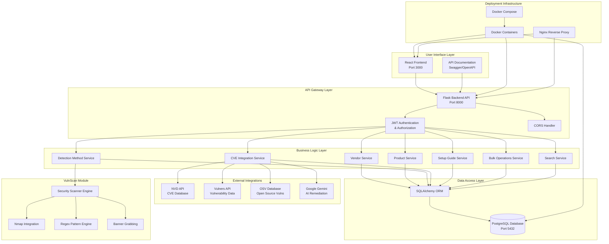
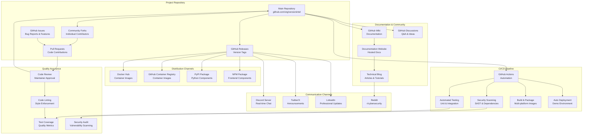
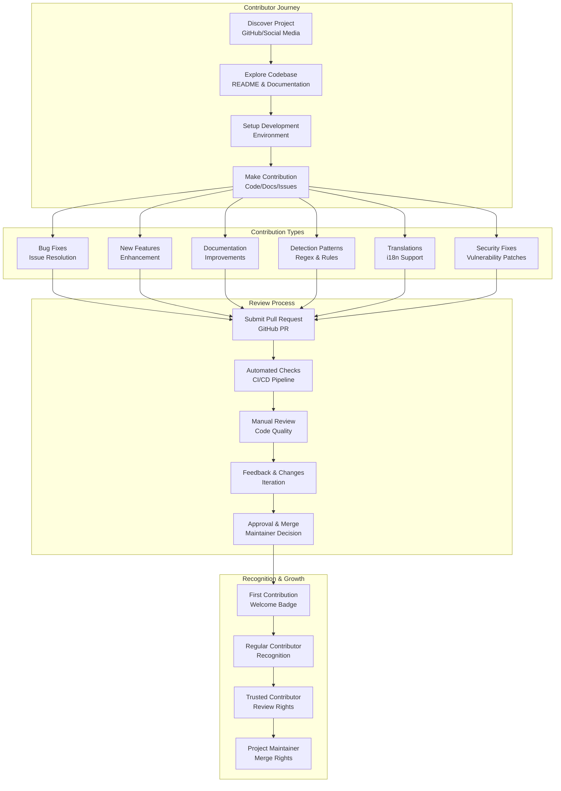
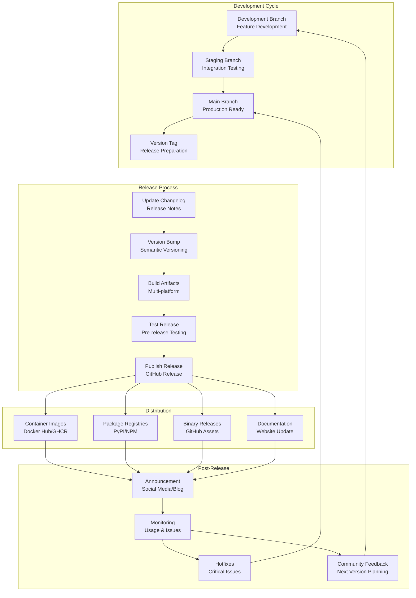
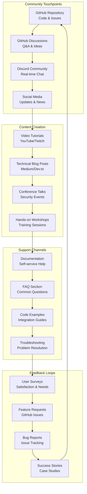
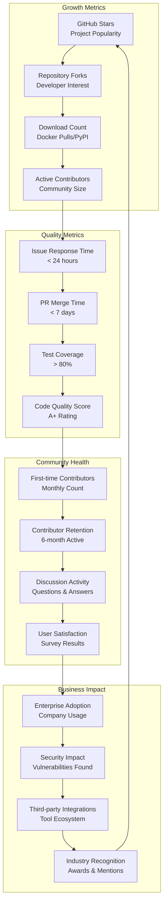

# VersionIntel Architecture & Open Source Ecosystem Flowchart

## 🏗️ System Architecture Flow

## 🌍 Open Source Ecosystem Flow

## 🤝 Contribution Workflow

## 🚀 Release & Distribution Flow

## 🎯 Community Engagement Flow

## 📊 Success Metrics Dashboard Flow

---

## 📋 Diagram Legend

- **Rectangles**: Processes, components, or systems
- **Diamonds**: Decision points or gateways
- **Cylinders**: Databases or data stores
- **Circles**: External services or APIs
- **Subgraphs**: Logical groupings of related components
- **Arrows**: Data flow or process flow direction

These flowcharts provide a comprehensive view of:
1. **System Architecture**: How components interact technically
2. **Open Source Ecosystem**: How the project integrates with the community
3. **Contribution Workflow**: How contributors engage with the project
4. **Release Process**: How versions are developed and distributed
5. **Community Engagement**: How users and contributors interact
6. **Success Metrics**: How project health and growth are measured