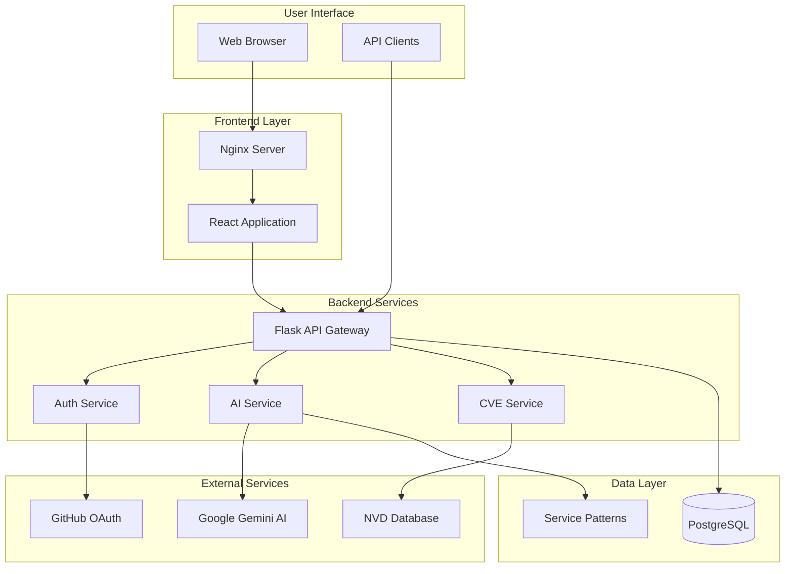
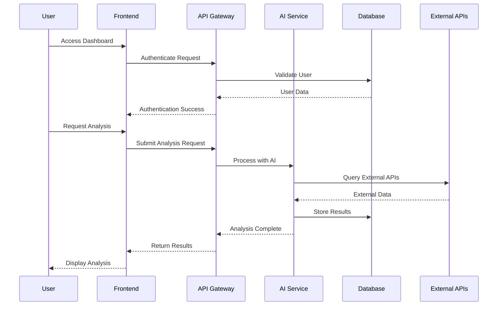
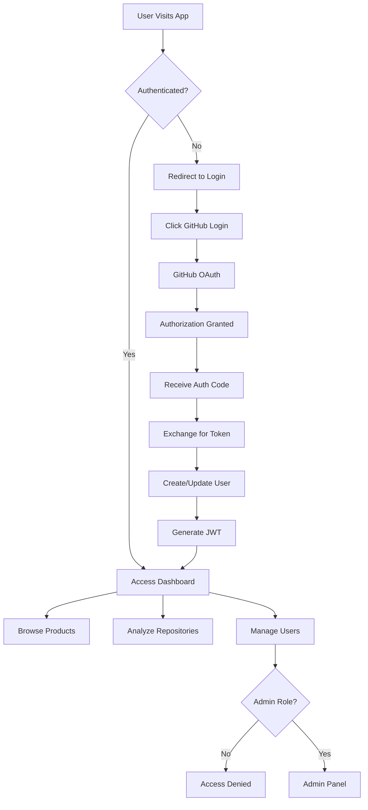
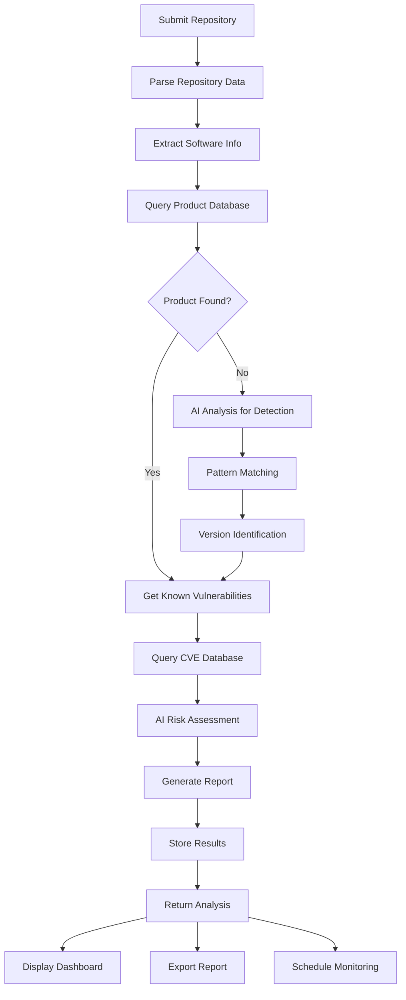
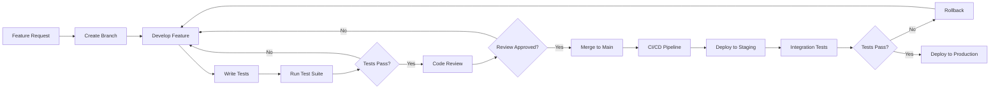

# VersionIntel

[](https://opensource.org/licenses/MIT)
[](https://hub.docker.com/)
[](https://python.org)
[](https://reactjs.org)
[](https://postgresql.org)

**VersionIntel** is a comprehensive platform designed to help security researchers, developers, and DevOps teams identify software versions and detect vulnerabilities through AI-powered analysis and repository scanning.

## 🌟 Features

### Core Capabilities
- 🔍 **Version Detection**: Automated software version identification using AI and pattern matching
- 🛡️ **Vulnerability Analysis**: AI-powered security assessment with CVE database integration
- 📊 **Analytics Dashboard**: Comprehensive overview of software inventory and security posture
- 🏢 **Product Management**: Centralized catalog of software products and vendors
- 🔌 **RESTful API**: Full-featured API with Swagger documentation
- 👥 **User Management**: Role-based access control with GitHub OAuth

### Security Features
- 🔐 **GitHub OAuth**: Secure authentication with GitHub integration
- 🛡️ **RBAC**: Role-based access control (Admin/Contributor)
- 🔒 **JWT Tokens**: Stateless authentication for API access
- 🔄 **Audit Logging**: Comprehensive activity tracking
- 🚨 **Rate Limiting**: API protection against abuse

### Technical Features
- 🐳 **Docker**: Containerized deployment with Docker Compose
- 🤖 **AI Integration**: Google Gemini API for intelligent analysis
- 📚 **NVD Integration**: National Vulnerability Database connectivity
- 🗄️ **PostgreSQL**: Robust database with full-text search
- ⚡ **Modern Stack**: React frontend with Flask backend

## 🏗️ System Architecture

### High-Level Architecture



### Data Flow Diagram



## 🚀 Quick Start

### Prerequisites

- **Docker** (version 20.10+)
- **Docker Compose** (version 1.29+)
- **Git**

### Installation

1. **Clone the Repository**
```bash
git clone https://github.com/your-username/versionintel.git
cd versionintel
```

2. **Configure Environment**
```bash
# Copy environment template
cp env.example .env

# Edit configuration (update SERVER_HOST, GitHub OAuth, etc.)
nano .env
```

3. **Deploy Application**

**Linux/Mac:**
```bash
chmod +x deploy-linux.sh
./deploy-linux.sh
```

**Windows:**
```batch
deploy-windows.bat
```

4. **Access Application**
- **Frontend**: http://localhost:3000 (or your server IP)
- **API Documentation**: http://localhost:8000/apidocs/
- **Health Check**: http://localhost:8000/health

### GitHub OAuth Setup

1. Go to [GitHub Developer Settings](https://github.com/settings/developers)
2. Create a new OAuth App with:
   - **Homepage URL**: `http://your-server-ip:3000`
   - **Callback URL**: `http://your-server-ip:3000/auth/github/callback`
3. Update `.env` with your Client ID and Secret

## 📊 Workflow Diagrams

### User Authentication Flow



### Vulnerability Detection Workflow



### Development Workflow



## 🛠️ Technology Stack

### Frontend
- **Framework**: React 18+ with functional components
- **Styling**: Tailwind CSS for responsive design
- **State Management**: React Context and custom hooks
- **Routing**: React Router for SPA navigation
- **Build Tool**: Create React App with optimizations

### Backend
- **Framework**: Flask with Flask-RESTful extensions
- **Database ORM**: SQLAlchemy with Alembic migrations
- **Authentication**: JWT tokens with GitHub OAuth
- **API Documentation**: Swagger/OpenAPI integration
- **Task Queue**: Background job processing

### Database
- **Primary**: PostgreSQL 13+ with JSON support
- **Features**: Full-text search, indexing, ACID compliance
- **Migrations**: Alembic for version control
- **Backup**: Automated backup strategies

### Infrastructure
- **Containerization**: Docker with multi-stage builds
- **Orchestration**: Docker Compose for local development
- **Reverse Proxy**: Nginx for production serving
- **Monitoring**: Health checks and logging

### External Integrations
- **AI Provider**: Google Gemini API for analysis
- **CVE Data**: National Vulnerability Database (NVD)
- **Authentication**: GitHub OAuth 2.0
- **Notifications**: Email and webhook support

## 📁 Project Structure

```
versionintel/
├── 📂 backend/                 # Flask backend application
│   ├── 📂 app/                # Application code
│   │   ├── 📂 models/         # Database models
│   │   ├── 📂 routes/         # API endpoints
│   │   ├── 📂 services/       # Business logic
│   │   └── 📄 main.py         # Application factory
│   ├── 📂 alembic/            # Database migrations
│   ├── 📄 requirements.txt    # Python dependencies
│   └── 📄 Dockerfile          # Backend container
├── 📂 frontend/               # React frontend application
│   ├── 📂 src/               # Source code
│   │   ├── 📂 components/    # React components
│   │   ├── 📂 pages/         # Page components
│   │   ├── 📂 hooks/         # Custom hooks
│   │   └── 📂 services/      # API services
│   ├── 📄 package.json       # Node dependencies
│   └── 📄 Dockerfile         # Frontend container
├── 📂 docs/                  # Comprehensive documentation
│   ├── 📂 api/              # API documentation
│   ├── 📂 architecture/     # System architecture
│   ├── 📂 deployment/       # Deployment guides
│   ├── 📂 user-guide/       # User documentation
│   └── 📂 development/      # Developer guides
├── 📂 tests/                 # Test suite
│   ├── 📂 backend/          # Backend tests
│   ├── 📂 frontend/         # Frontend tests
│   └── 📂 integration/      # E2E tests
├── 📂 patterns/              # Service detection patterns
├── 📄 docker-compose.yml     # Container orchestration
├── 📄 deploy-linux.sh        # Linux deployment script
├── 📄 deploy-windows.bat     # Windows deployment script
└── 📄 README.md              # This file
```

## 🔧 Configuration

### Environment Variables

#### Required Configuration
```bash
# Server Configuration
SERVER_HOST=your-server-ip          # Server IP address
BACKEND_PORT=8000                    # Backend API port
FRONTEND_PORT=3000                   # Frontend port

# GitHub OAuth (Required)
GITHUB_CLIENT_ID=your_client_id
GITHUB_CLIENT_SECRET=your_secret
GITHUB_REDIRECT_URI=http://your-server-ip:3000/auth/github/callback

# Security Keys (Required)
SECRET_KEY=your-secure-secret-key
JWT_SECRET_KEY=your-jwt-secret-key

# Database Configuration
POSTGRES_USER=postgres
POSTGRES_PASSWORD=secure-password
POSTGRES_DB=versionintel
```

#### Optional Configuration
```bash
# AI Integration
GOOGLE_API_KEY=your-google-api-key   # For enhanced AI features
AI_PROVIDER=gemini                   # AI provider selection

# NVD API
NVD_API_KEY=your-nvd-api-key        # For higher rate limits

# CORS Configuration
CORS_ORIGINS=http://localhost:3000,http://your-domain.com
```

### Server Migration

To deploy on a different server:

1. **Update Server IP**: Change `SERVER_HOST` in `.env`
2. **Update GitHub OAuth**: Update callback URL in GitHub app settings
3. **Update CORS**: Add new domain to `CORS_ORIGINS`
4. **Regenerate Secrets**: Create new secure keys for production
5. **Run Deployment**: Execute platform-specific deployment script

## 🧪 Testing

### Running Tests

**All Tests:**
```bash
# Run comprehensive test suite
python tests/run_all_tests.py

# With coverage and verbose output
python tests/run_all_tests.py --verbose
```

**Individual Test Suites:**
```bash
# Backend tests only
python tests/run_all_tests.py --backend-only

# Frontend tests only
python tests/run_all_tests.py --frontend-only

# Integration tests only
python tests/run_all_tests.py --integration-only
```

**Manual Testing:**
```bash
# Backend tests
cd backend && python -m pytest

# Frontend tests
cd frontend && npm test

# Linting
python tests/run_all_tests.py --no-coverage
```

### Test Coverage

Our testing suite maintains high coverage standards:
- **Backend**: 85%+ test coverage
- **Frontend**: 80%+ test coverage
- **Integration**: Critical user journeys covered
- **API**: All endpoints tested

## 📖 Documentation

### User Documentation
- 📚 [Getting Started Guide](docs/user-guide/getting-started.md)
- 🏠 [Dashboard Overview](docs/user-guide/dashboard.md)
- 🔍 [Repository Scanning](docs/user-guide/repository-scanning.md)
- 👥 [User Management](docs/user-guide/user-management.md)

### API Documentation
- 🔌 [API Overview](docs/api/overview.md)
- 🔐 [Authentication](docs/api/authentication.md)
- 📋 [Endpoints Reference](docs/api/endpoints.md)
- ⚠️ [Error Handling](docs/api/error-handling.md)

### Deployment Documentation
- ⚡ [Quick Start](docs/deployment/quick-start.md)
- 🔧 [Environment Configuration](docs/deployment/environment-configuration.md)
- 🚀 [Production Setup](docs/deployment/production-setup.md)
- 🔧 [Troubleshooting](docs/deployment/troubleshooting.md)

### Development Documentation
- 🛠️ [Development Setup](docs/development/setup.md)
- 📝 [Code Standards](docs/development/code-standards.md)
- 🧪 [Testing Guide](docs/development/testing.md)
- 🤝 [Contributing](docs/development/contributing.md)

## 🔧 Management Commands

### Service Management
```bash
# View service status
docker-compose ps

# View logs
docker-compose logs -f [service_name]

# Restart services
docker-compose restart

# Stop services
docker-compose down

# Update and redeploy
git pull && ./deploy-linux.sh
```

### Database Management
```bash
# Access database
docker-compose exec db psql -U postgres -d versionintel

# Backup database
docker-compose exec db pg_dump -U postgres versionintel > backup.sql

# Restore database
docker-compose exec -T db psql -U postgres versionintel < backup.sql

# Run migrations
docker-compose exec backend alembic upgrade head
```

### User Management
```bash
# Access backend container
docker-compose exec backend bash

# List users
python scripts/list_users.py

# Reset admin password (if using legacy auth)
python scripts/reset_admin_password.py
```

## 🤝 Contributing

We welcome contributions! Please see our [Contributing Guide](docs/development/contributing.md) for details.

### Development Setup
1. Fork the repository
2. Clone your fork
3. Set up development environment
4. Create feature branch
5. Make changes and add tests
6. Submit pull request

### Code Standards
- **Backend**: Follow PEP 8, use Black formatter
- **Frontend**: ESLint with Prettier formatting
- **Testing**: Maintain 80%+ test coverage
- **Documentation**: Update docs for new features

## 📄 License

This project is licensed under the MIT License - see the [LICENSE](LICENSE) file for details.

## 🆘 Support

### Getting Help
- 📖 **Documentation**: Comprehensive guides available in `/docs`
- 🐛 **Issues**: Report bugs via GitHub Issues
- 💬 **Discussions**: Join community discussions
- 📧 **Contact**: Reach out for enterprise support

### Troubleshooting
- ⚡ [Quick Start Issues](docs/deployment/quick-start.md#troubleshooting)
- 🔧 [Deployment Problems](docs/deployment/troubleshooting.md)
- 🔑 [Authentication Issues](docs/api/authentication.md#troubleshooting)
- 🗄️ [Database Problems](docs/deployment/troubleshooting.md#database-issues)

## 🎯 Roadmap

### Current Version (v1.0)
- ✅ Core platform functionality
- ✅ GitHub OAuth authentication
- ✅ Basic AI integration
- ✅ RESTful API with documentation
- ✅ Docker deployment

### Upcoming Features (v1.1)
- 🔄 Real-time notifications
- 📊 Advanced analytics dashboard
- 🔌 Webhook integrations
- 📱 Mobile-responsive improvements
- ⚡ Performance optimizations

### Future Enhancements (v2.0)
- 🤖 Enhanced AI capabilities
- 🔌 Plugin architecture
- 📈 Reporting and compliance
- 🌐 Multi-tenant support
- 🔒 Advanced security features

---

**Built with ❤️ by the VersionIntel Team**

*Empowering security through intelligent version detection and vulnerability analysis.*