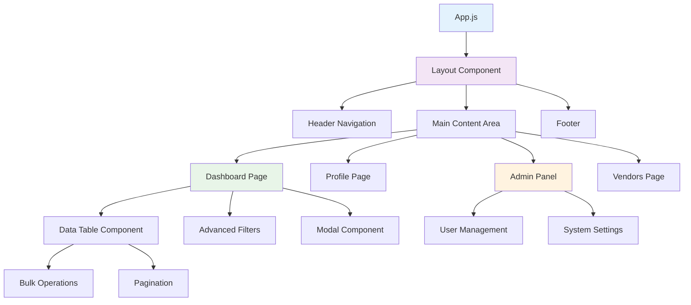
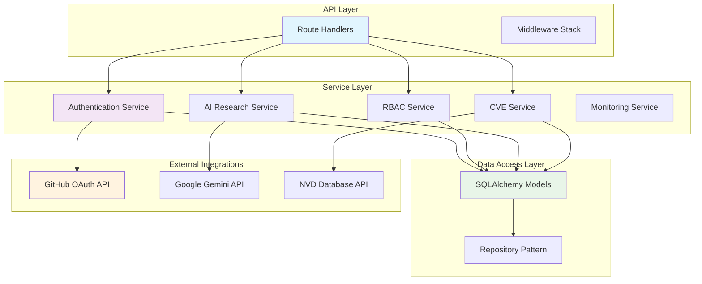
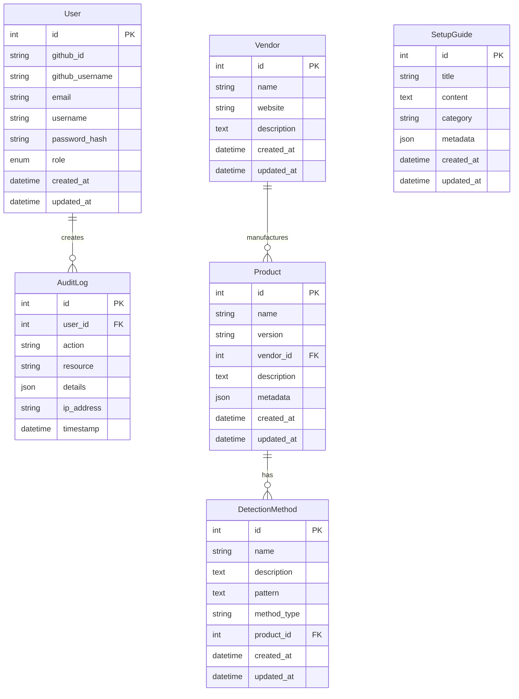
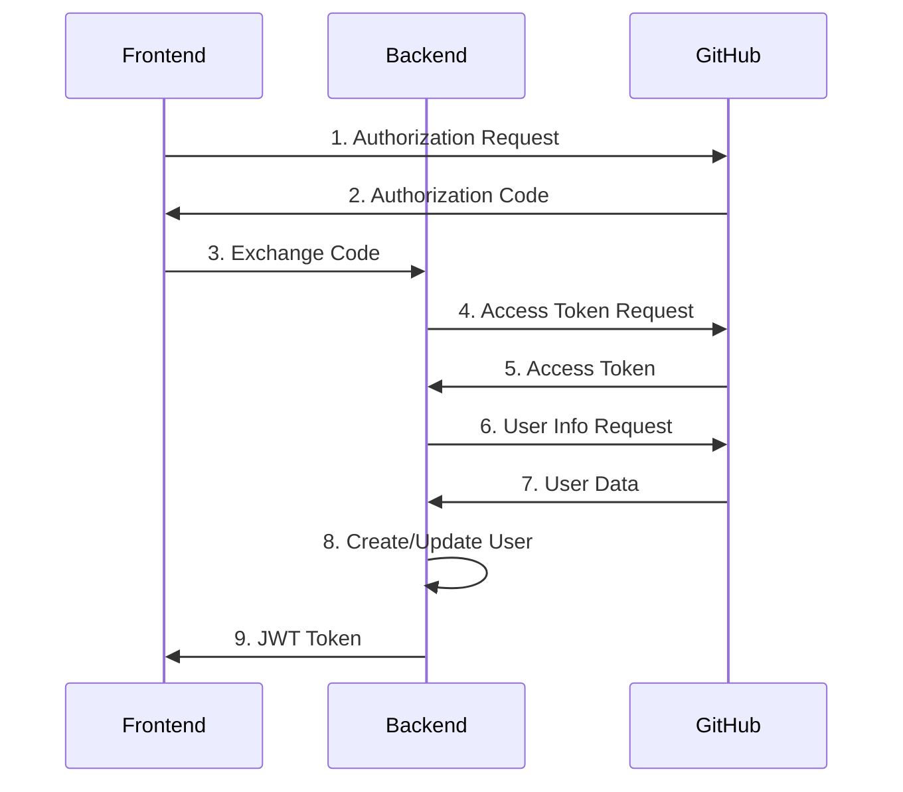

# Component Architecture

## Overview

VersionIntel follows a modular microservices architecture where each component has a specific responsibility and communicates through well-defined interfaces. This document details the internal architecture of each major component.

## Frontend Architecture

### React Application Structure

```
frontend/src/
├── components/          # Reusable UI components
├── pages/              # Page-level components
├── hooks/              # Custom React hooks
├── services/           # API communication services
├── utils/              # Utility functions
├── styles/             # Global styles and themes
└── App.js              # Main application component
```

### Component Hierarchy



### State Management

#### Context Providers
```javascript
// Authentication Context
const AuthContext = createContext({
  user: null,
  token: null,
  login: () => {},
  logout: () => {},
  isAuthenticated: false,
  isAdmin: false
});

// Application Context
const AppContext = createContext({
  loading: false,
  error: null,
  notification: null,
  setLoading: () => {},
  setError: () => {},
  showNotification: () => {}
});
```

#### Custom Hooks
- `useAuth()`: Authentication state and methods
- `useApi()`: API communication with loading states
- `useLocalStorage()`: Local storage management
- `useDebounce()`: Input debouncing for search

### Component Design Patterns

#### Higher-Order Components (HOCs)
```javascript
// Authentication HOC
const withAuth = (WrappedComponent) => {
  return (props) => {
    const { isAuthenticated } = useAuth();
    return isAuthenticated ? <WrappedComponent {...props} /> : <Redirect to="/login" />;
  };
};

// Admin Access HOC
const withAdminAccess = (WrappedComponent) => {
  return (props) => {
    const { isAdmin } = useAuth();
    return isAdmin ? <WrappedComponent {...props} /> : <UnauthorizedPage />;
  };
};
```

## Backend Architecture

### Flask Application Structure

```
backend/app/
├── models/             # Database models
├── routes/             # API route handlers
├── services/           # Business logic services
├── utils/              # Utility functions
├── config.py           # Configuration management
└── main.py             # Application factory
```

### Service Layer Architecture



### Service Interfaces

#### Authentication Service
```python
class AuthService:
    def authenticate_github_user(self, code: str) -> dict
    def generate_jwt_token(self, user: User) -> str
    def validate_jwt_token(self, token: str) -> User
    def refresh_token(self, refresh_token: str) -> str
    def logout_user(self, token: str) -> bool
```

#### RBAC Service
```python
class RBACService:
    def check_permission(self, user: User, resource: str, action: str) -> bool
    def assign_role(self, user: User, role: UserRole) -> bool
    def get_user_permissions(self, user: User) -> List[Permission]
    def is_admin(self, user: User) -> bool
    def can_access_admin_panel(self, user: User) -> bool
```

#### AI Research Service
```python
class AIResearchService:
    def analyze_repository(self, repo_url: str) -> dict
    def detect_vulnerabilities(self, software_info: dict) -> List[dict]
    def get_version_recommendations(self, product: str) -> dict
    def analyze_security_patterns(self, patterns: List[str]) -> dict
```

### Database Models Architecture

#### Entity Relationship Diagram



### Middleware Stack

#### Request Processing Pipeline
```python
# Middleware execution order
1. CORS Middleware
2. Request Logging Middleware
3. Authentication Middleware
4. RBAC Authorization Middleware
5. Rate Limiting Middleware
6. Request Validation Middleware
7. Route Handler
8. Response Serialization Middleware
9. Error Handling Middleware
10. Response Logging Middleware
```

#### Custom Middleware Implementation
```python
class AuthenticationMiddleware:
    def __init__(self, app):
        self.app = app
        
    def __call__(self, environ, start_response):
        # Extract and validate JWT token
        # Set user context
        # Continue to next middleware
        pass

class RBACMiddleware:
    def __init__(self, app):
        self.app = app
        
    def __call__(self, environ, start_response):
        # Check user permissions
        # Authorize resource access
        # Continue or reject request
        pass
```

## Database Architecture

### PostgreSQL Schema Design

#### Normalized Database Structure
- **Users Table**: Authentication and profile data
- **Vendors Table**: Software vendor information
- **Products Table**: Software products and versions
- **Detection Methods Table**: Version detection patterns
- **Setup Guides Table**: Installation guides
- **Audit Logs Table**: System activity tracking

#### Indexing Strategy
```sql
-- Primary indexes for fast lookups
CREATE INDEX idx_users_github_id ON users(github_id);
CREATE INDEX idx_users_email ON users(email);
CREATE INDEX idx_products_vendor_id ON products(vendor_id);
CREATE INDEX idx_detection_methods_product_id ON detection_methods(product_id);

-- Composite indexes for complex queries
CREATE INDEX idx_audit_logs_user_timestamp ON audit_logs(user_id, timestamp);
CREATE INDEX idx_products_name_version ON products(name, version);

-- Full-text search indexes
CREATE INDEX idx_products_search ON products USING gin(to_tsvector('english', name || ' ' || description));
```

### Data Access Patterns

#### Repository Pattern Implementation
```python
class BaseRepository:
    def __init__(self, model):
        self.model = model
    
    def create(self, **kwargs):
        instance = self.model(**kwargs)
        db.session.add(instance)
        db.session.commit()
        return instance
    
    def get_by_id(self, id):
        return self.model.query.get(id)
    
    def update(self, id, **kwargs):
        instance = self.get_by_id(id)
        for key, value in kwargs.items():
            setattr(instance, key, value)
        db.session.commit()
        return instance
    
    def delete(self, id):
        instance = self.get_by_id(id)
        db.session.delete(instance)
        db.session.commit()

class UserRepository(BaseRepository):
    def __init__(self):
        super().__init__(User)
    
    def get_by_github_id(self, github_id):
        return self.model.query.filter_by(github_id=github_id).first()
    
    def get_by_email(self, email):
        return self.model.query.filter_by(email=email).first()
```

## External Service Integration

### GitHub OAuth Integration

#### OAuth Flow Architecture


### Google Gemini AI Integration

#### AI Service Architecture
```python
class GeminiAIService:
    def __init__(self):
        self.client = genai.GenerativeModel('gemini-1.5-flash')
    
    def analyze_repository(self, repo_data):
        prompt = self._build_analysis_prompt(repo_data)
        response = self.client.generate_content(prompt)
        return self._parse_analysis_response(response)
    
    def detect_vulnerabilities(self, software_info):
        prompt = self._build_vulnerability_prompt(software_info)
        response = self.client.generate_content(prompt)
        return self._parse_vulnerability_response(response)
```

### NVD API Integration

#### CVE Data Retrieval
```python
class NVDService:
    def __init__(self, api_key=None):
        self.api_key = api_key
        self.base_url = "https://services.nvd.nist.gov/rest/json"
    
    def search_cves(self, keywords, limit=20):
        params = {
            'keywordSearch': keywords,
            'resultsPerPage': limit
        }
        response = self._make_request('/cves/2.0', params)
        return self._parse_cve_response(response)
```

## Error Handling Architecture

### Exception Hierarchy
```python
class VersionIntelException(Exception):
    """Base exception for VersionIntel"""
    pass

class AuthenticationException(VersionIntelException):
    """Authentication related errors"""
    pass

class AuthorizationException(VersionIntelException):
    """Authorization related errors"""
    pass

class ValidationException(VersionIntelException):
    """Data validation errors"""
    pass

class ExternalServiceException(VersionIntelException):
    """External service integration errors"""
    pass
```

### Global Error Handler
```python
@app.errorhandler(Exception)
def handle_exception(e):
    if isinstance(e, VersionIntelException):
        return jsonify({
            'error': e.__class__.__name__,
            'message': str(e)
        }), 400
    
    logger.exception("Unhandled exception occurred")
    return jsonify({
        'error': 'InternalServerError',
        'message': 'An unexpected error occurred'
    }), 500
```

This component architecture provides a solid foundation for maintainable, scalable, and secure application development.