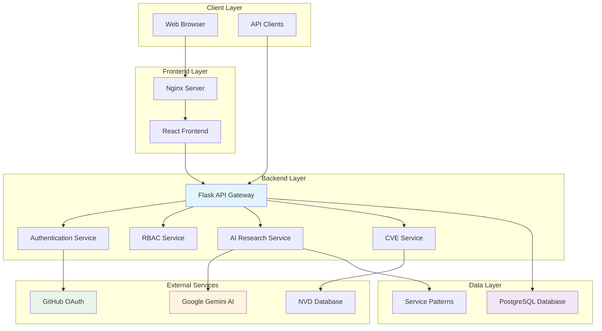
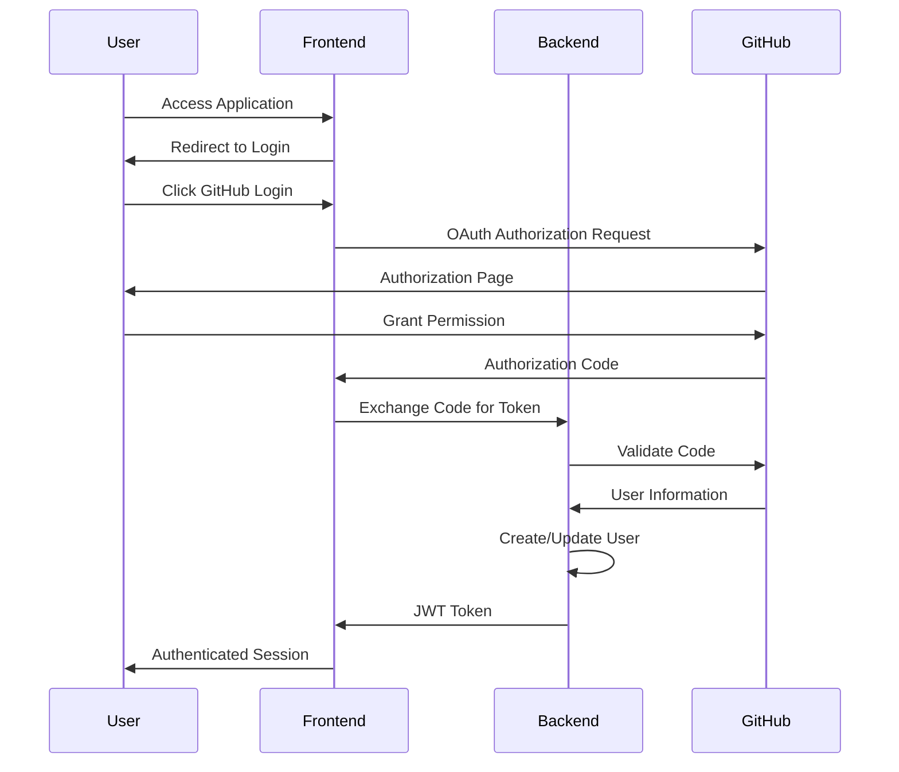
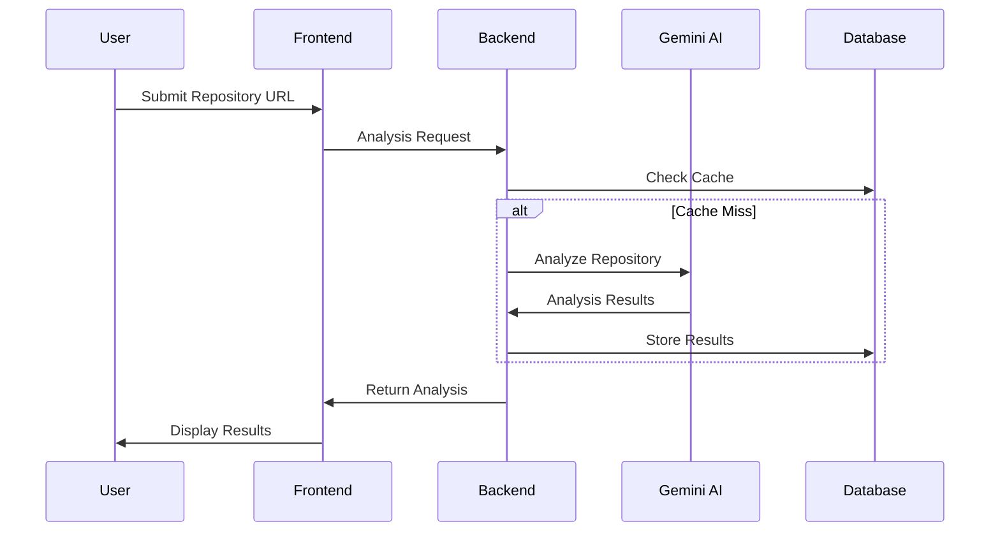
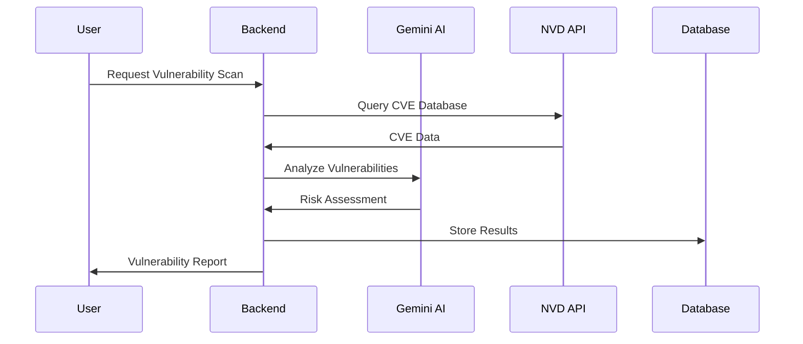

# System Overview

## Introduction

VersionIntel is a sophisticated version detection research platform designed to help security researchers, developers, and DevOps teams identify software versions and detect vulnerabilities through AI-powered analysis and comprehensive repository scanning.

## System Architecture

### High-Level Architecture

## Core Components

### 1. Frontend Layer

#### React Application
- **Technology**: React 18+ with functional components and hooks
- **Styling**: Tailwind CSS for responsive design
- **State Management**: React Context and custom hooks
- **Routing**: React Router for client-side navigation
- **Components**: Reusable components for UI consistency

#### Nginx Server
- **Purpose**: Serves static React files and handles reverse proxy
- **Configuration**: Optimized for production serving
- **Features**: Gzip compression, caching headers, security headers

### 2. Backend Layer

#### Flask API Gateway
- **Framework**: Flask with Flask-RESTful extensions
- **Architecture**: Microservices pattern with modular design
- **Features**:
  - RESTful API endpoints
  - Swagger/OpenAPI documentation
  - Request validation and serialization
  - Error handling and logging
  - CORS support

#### Authentication Service
- **Primary Method**: GitHub OAuth 2.0
- **Secondary Method**: JWT token-based authentication
- **Features**:
  - OAuth flow management
  - Token generation and validation
  - Session management
  - User profile integration

#### RBAC Service
- **Roles**: Admin, Contributor
- **Permissions**: Resource-based access control
- **Features**:
  - Role assignment and management
  - Permission checking middleware
  - Admin panel access control

#### AI Research Service
- **Provider**: Google Gemini API
- **Capabilities**:
  - Version detection analysis
  - Vulnerability assessment
  - Security recommendation generation
  - Pattern matching and analysis

#### CVE Service
- **Data Source**: National Vulnerability Database (NVD)
- **Features**:
  - CVE data retrieval and caching
  - Vulnerability scoring
  - Impact assessment
  - Remediation suggestions

### 3. Data Layer

#### PostgreSQL Database
- **Version**: PostgreSQL 13+
- **Features**:
  - ACID compliance
  - JSON support for flexible data
  - Full-text search capabilities
  - Backup and recovery support

#### Database Schema
- **Users**: User accounts and authentication data
- **Products**: Software products and versions
- **Vendors**: Software vendors and manufacturers
- **Detection Methods**: Version detection patterns
- **Setup Guides**: Installation and configuration guides
- **Audit Logs**: System activity tracking

#### Service Patterns
- **Format**: JSON configuration files
- **Purpose**: Define service banners and detection patterns
- **Categories**: Common, specific, and extended patterns

## Data Flow

### 1. User Authentication Flow

### 2. Repository Analysis Flow

### 3. Vulnerability Detection Flow

## Security Architecture

### Authentication & Authorization

#### Multi-layered Security
1. **OAuth 2.0**: Secure third-party authentication via GitHub
2. **JWT Tokens**: Stateless authentication for API access
3. **RBAC**: Role-based access control for resource protection
4. **CORS**: Cross-origin request protection

#### Security Headers
- Content Security Policy (CSP)
- X-Frame-Options
- X-Content-Type-Options
- Strict-Transport-Security

### Data Protection

#### Encryption
- **In Transit**: HTTPS/TLS encryption for all communications
- **At Rest**: Database encryption for sensitive data
- **Secrets**: Environment variable-based secret management

#### Input Validation
- Request payload validation
- SQL injection prevention
- XSS protection
- CSRF protection

## Performance Considerations

### Caching Strategy
- **Database Queries**: Connection pooling and query optimization
- **API Responses**: Response caching for frequently accessed data
- **Static Assets**: CDN delivery and browser caching

### Scalability
- **Horizontal Scaling**: Container-based deployment for easy scaling
- **Database Optimization**: Indexed queries and query optimization
- **Asynchronous Processing**: Background tasks for heavy operations

### Monitoring
- **Health Checks**: Endpoint monitoring and alerting
- **Logging**: Comprehensive application logging
- **Metrics**: Performance metrics collection
- **Error Tracking**: Error monitoring and reporting

## Deployment Architecture

### Containerization
- **Docker**: Application containerization
- **Docker Compose**: Multi-container orchestration
- **Environment**: Configuration via environment variables

### Infrastructure
- **Development**: Local Docker development environment
- **Production**: Cloud-based container deployment
- **CI/CD**: Automated testing and deployment pipelines

This system overview provides a comprehensive understanding of VersionIntel's architecture, components, and operational characteristics.