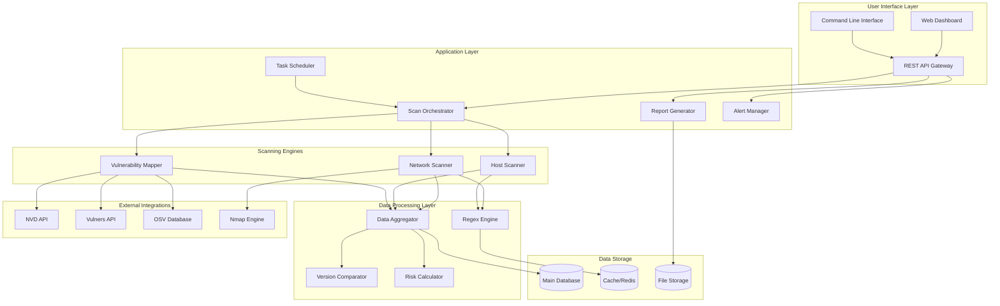

# Security Scanner Platform - Design Document

## Overview

The Security Scanner Platform is designed as a modular, microservices-based architecture that provides comprehensive vulnerability assessment capabilities. The system combines network and host-based scanning with intelligent vulnerability correlation and automated reporting. The platform follows a plugin-based architecture to ensure extensibility and maintainability while supporting enterprise-scale deployments.

### Core Design Principles

- **Modularity**: Each scanning capability is implemented as an independent module
- **Extensibility**: Plugin architecture supports adding new scanners, CVE sources, and output formats
- **Scalability**: Horizontal scaling support with distributed scanning capabilities
- **Security**: Zero-trust architecture with encrypted communications and secure credential management
- **Performance**: Asynchronous processing with intelligent caching and optimization
- **Reliability**: Fault-tolerant design with comprehensive error handling and recovery

## Architecture

### High-Level Architecture



### Microservices Architecture

The platform is composed of the following core services:

1. **API Gateway Service**: Central entry point for all client interactions
2. **Scan Orchestrator Service**: Coordinates and manages scanning workflows
3. **Network Scanner Service**: Handles Nmap integration and network discovery
4. **Host Scanner Service**: Manages host-based software inventory scanning
5. **Vulnerability Mapper Service**: Integrates with CVE data sources
6. **Data Aggregator Service**: Processes and correlates scan results
7. **Report Generator Service**: Creates multi-format vulnerability reports
8. **Alert Manager Service**: Handles notifications and alerting
9. **Scheduler Service**: Manages automated and recurring scans

## Components and Interfaces

### 1. Network Scanner Component

**Purpose**: Discover network assets and identify running services with version information.

**Key Interfaces**:
```python
class NetworkScanner:
    def discover_hosts(self, targets: List[str], scan_options: ScanOptions) -> List[Host]
    def scan_ports(self, hosts: List[Host], port_range: str) -> List[Service]
    def detect_services(self, services: List[Service]) -> List[ServiceInfo]
    def extract_versions(self, service_info: List[ServiceInfo]) -> List[VersionInfo]
```

**Integration Points**:
- Nmap subprocess execution with XML output parsing
- Regex engine for version extraction from service banners
- Data aggregator for result correlation

**Configuration**:
- Scan timing templates (aggressive, normal, polite)
- Custom NSE script selection
- Port range specifications
- Timeout and retry settings

### 2. Host Scanner Component

**Purpose**: Inventory installed software across different operating systems.

**Key Interfaces**:
```python
class HostScanner:
    def scan_packages(self, host: Host, scan_type: ScanType) -> List[Package]
    def scan_binaries(self, host: Host, paths: List[str]) -> List[Binary]
    def extract_file_versions(self, files: List[str]) -> List[FileVersion]
    def query_package_managers(self, host: Host) -> List[PackageInfo]
```

**Platform Adapters**:
- **LinuxAdapter**: Supports apt, yum, dnf, pacman, zypper
- **WindowsAdapter**: Registry scanning, MSI database, WMI queries
- **MacOSAdapter**: Application bundles, Homebrew, system profiler

**Detection Methods**:
- Package manager queries
- Binary signature scanning
- Configuration file parsing
- Registry analysis (Windows)
- File system traversal

### 3. Regex Engine Component

**Purpose**: Provide high-performance pattern matching for version extraction.

**Key Interfaces**:
```python
class RegexEngine:
    def load_patterns(self, pattern_file: str) -> None
    def match_version(self, text: str, context: str) -> VersionMatch
    def validate_pattern(self, pattern: RegexPattern) -> ValidationResult
    def update_patterns(self, new_patterns: List[RegexPattern]) -> None
```

**Pattern Categories**:
- HTTP server headers
- Service banners
- Binary signatures
- Package metadata
- Configuration files

**Performance Optimizations**:
- Compiled regex caching
- Pattern prioritization
- Parallel matching for large datasets
- Memory-efficient pattern storage

### 4. Vulnerability Mapper Component

**Purpose**: Map identified software versions to known vulnerabilities.

**Key Interfaces**:
```python
class VulnerabilityMapper:
    def query_nvd(self, cpe: str, version: str) -> List[CVE]
    def query_vulners(self, software: SoftwareInfo) -> List[Vulnerability]
    def query_osv(self, package: PackageInfo) -> List[OSVEntry]
    def compare_versions(self, version: str, vuln_range: str) -> bool
```

**Data Source Integration**:
- **NVD Integration**: CPE matching, CVSS scoring, reference links
- **Vulners Integration**: Enhanced exploit information, proof-of-concept availability
- **OSV Integration**: Open source specific vulnerabilities, ecosystem data

**Version Comparison Logic**:
- Semantic versioning (SemVer) support
- Vendor-specific version schemes
- Range parsing (>=, <=, ~, ^)
- Backport detection and handling

### 5. Data Aggregator Component

**Purpose**: Centralize, normalize, and correlate scan results.

**Key Interfaces**:
```python
class DataAggregator:
    def merge_scan_results(self, results: List[ScanResult]) -> AggregatedResult
    def normalize_software_info(self, software: List[SoftwareInfo]) -> List[NormalizedSoftware]
    def correlate_vulnerabilities(self, vulns: List[Vulnerability]) -> List[CorrelatedVuln]
    def calculate_risk_scores(self, vulns: List[CorrelatedVuln]) -> List[RiskAssessment]
```

**Data Processing Pipeline**:
1. **Ingestion**: Collect results from all scanning engines
2. **Normalization**: Standardize vendor names, product names, versions
3. **Deduplication**: Remove duplicate software entries across scan types
4. **Correlation**: Link vulnerabilities to affected software instances
5. **Risk Scoring**: Calculate comprehensive risk metrics
6. **Storage**: Persist processed data to main database

### 6. Report Generator Component

**Purpose**: Create comprehensive vulnerability reports in multiple formats.

**Key Interfaces**:
```python
class ReportGenerator:
    def generate_json_report(self, data: ReportData, template: str) -> JSONReport
    def generate_html_report(self, data: ReportData, template: str) -> HTMLReport
    def generate_pdf_report(self, data: ReportData, template: str) -> PDFReport
    def create_executive_summary(self, data: ReportData) -> ExecutiveSummary
```

**Report Types**:
- **Technical Reports**: Detailed vulnerability listings with remediation steps
- **Executive Summaries**: High-level risk metrics and trends
- **Compliance Reports**: Regulatory-focused vulnerability assessments
- **Trend Analysis**: Historical vulnerability data and improvement metrics

**Template System**:
- Jinja2-based templating engine
- Custom CSS/styling support
- Dynamic chart generation
- Multi-language support

## Data Models

### Core Data Structures

```python
@dataclass
class Host:
    ip_address: str
    hostname: Optional[str]
    os_info: OSInfo
    open_ports: List[Port]
    services: List[Service]
    software: List[Software]
    scan_timestamp: datetime
    
@dataclass
class Software:
    vendor: str
    product: str
    version: str
    cpe: Optional[str]
    source: ScanSource  # network, host, registry, etc.
    confidence: float
    vulnerabilities: List[Vulnerability]
    
@dataclass
class Vulnerability:
    cve_id: str
    cvss_score: float
    severity: Severity
    description: str
    affected_versions: List[str]
    references: List[str]
    exploit_available: bool
    patch_available: bool
    
@dataclass
class ScanResult:
    scan_id: str
    scan_type: ScanType
    target: str
    start_time: datetime
    end_time: datetime
    status: ScanStatus
    hosts: List[Host]
    errors: List[ScanError]
```

### Database Schema

**Primary Tables**:
- `scans`: Scan metadata and configuration
- `hosts`: Discovered host information
- `software`: Software inventory with version details
- `vulnerabilities`: CVE data with CVSS scores
- `scan_results`: Aggregated scan findings
- `reports`: Generated report metadata
- `alerts`: Alert configuration and history

**Indexing Strategy**:
- Composite indexes on (vendor, product, version)
- Full-text search indexes on vulnerability descriptions
- Time-series indexes for scan history
- Geospatial indexes for network topology

## Error Handling

### Error Categories

1. **Network Errors**: Connection timeouts, unreachable hosts, permission denied
2. **Parsing Errors**: Malformed XML/JSON, unexpected data formats
3. **API Errors**: Rate limiting, authentication failures, service unavailability
4. **System Errors**: Insufficient disk space, memory exhaustion, process crashes
5. **Data Errors**: Invalid versions, missing CVE data, corrupted databases

### Error Handling Strategy

```python
class ErrorHandler:
    def handle_network_error(self, error: NetworkError) -> ErrorResponse
    def handle_parsing_error(self, error: ParsingError) -> ErrorResponse
    def handle_api_error(self, error: APIError) -> ErrorResponse
    def retry_with_backoff(self, operation: Callable, max_retries: int) -> Any
```

**Recovery Mechanisms**:
- Exponential backoff for API rate limiting
- Graceful degradation when data sources are unavailable
- Partial result reporting when scans partially fail
- Automatic retry logic with configurable limits
- Circuit breaker pattern for external service calls

## Testing Strategy

### Unit Testing
- **Coverage Target**: 95% code coverage
- **Framework**: pytest with fixtures and mocks
- **Focus Areas**: Version comparison logic, regex pattern matching, data normalization
- **Test Data**: Synthetic and real-world software version strings

### Integration Testing
- **API Testing**: Full REST API endpoint validation
- **Database Testing**: Data persistence and retrieval accuracy
- **External Service Testing**: Mock CVE API responses
- **Cross-Platform Testing**: Linux, Windows, macOS compatibility

### Performance Testing
- **Load Testing**: 10,000 host scanning scenarios
- **Stress Testing**: Memory and CPU utilization under peak load
- **Scalability Testing**: Horizontal scaling validation
- **Benchmark Testing**: Version comparison and regex matching performance

### Security Testing
- **Penetration Testing**: API security and authentication bypass attempts
- **Vulnerability Scanning**: Static and dynamic code analysis
- **Credential Testing**: Secure storage and transmission validation
- **Access Control Testing**: RBAC implementation verification

### End-to-End Testing
- **Workflow Testing**: Complete scan-to-report workflows
- **Multi-Platform Testing**: Cross-OS scanning accuracy
- **Alert Testing**: Notification delivery and escalation
- **Disaster Recovery Testing**: System recovery and data integrity

## Deployment Architecture

### Container Strategy
```dockerfile
# Multi-stage build for optimized images
FROM python:3.11-slim as base
# Security scanner service container
FROM base as scanner
COPY requirements.txt .
RUN pip install --no-cache-dir -r requirements.txt
COPY src/ /app/
WORKDIR /app
CMD ["python", "-m", "scanner.main"]
```

### Kubernetes Deployment
```yaml
apiVersion: apps/v1
kind: Deployment
metadata:
  name: security-scanner
spec:
  replicas: 3
  selector:
    matchLabels:
      app: security-scanner
  template:
    spec:
      containers:
      - name: scanner
        image: security-scanner:latest
        resources:
          requests:
            memory: "512Mi"
            cpu: "250m"
          limits:
            memory: "2Gi"
            cpu: "1000m"
```

### High Availability Configuration
- **Load Balancing**: NGINX or HAProxy for request distribution
- **Database Clustering**: PostgreSQL with read replicas
- **Cache Clustering**: Redis Cluster for distributed caching
- **Service Mesh**: Istio for service-to-service communication
- **Monitoring**: Prometheus and Grafana for observability

This design provides a robust, scalable foundation for the security scanner platform that addresses all requirements while maintaining flexibility for future enhancements.